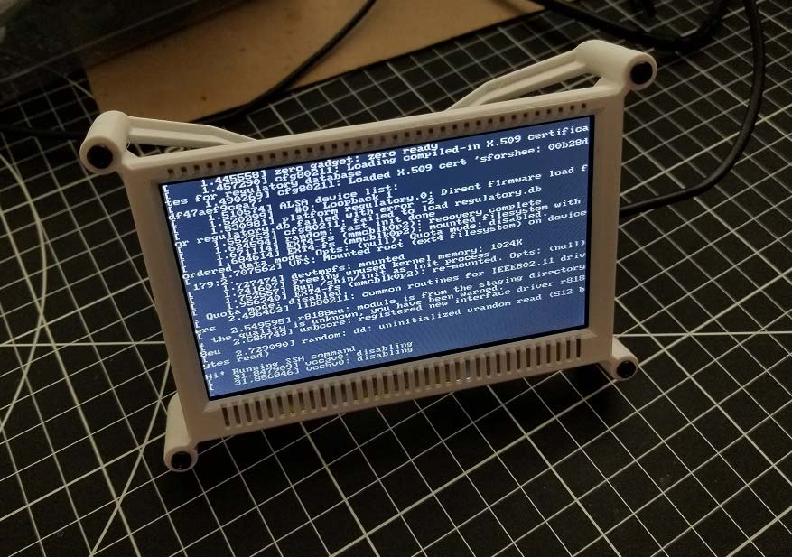

# TUI Kiosk on Lichee Pi (WIP)



## Dev

Create `.env` file:

```
STEPS_TRANSIT_URL=...
STEPS_TODOS_URL=...
STEPS_KEY=...

OPEN_WEATHER_MAP_LATLON=40.7478469,-73.980106
OPEN_WEATHER_MAP_KEY=...
```

Create `kiosk_id_rsa.pub` file.

Packaging:

```
yarn build
docker build -t tuiview .
```
